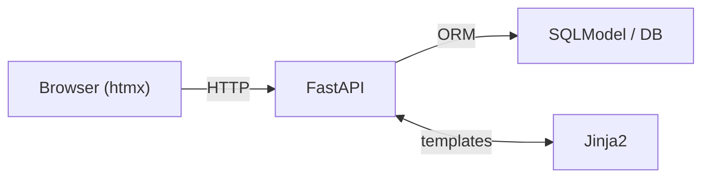
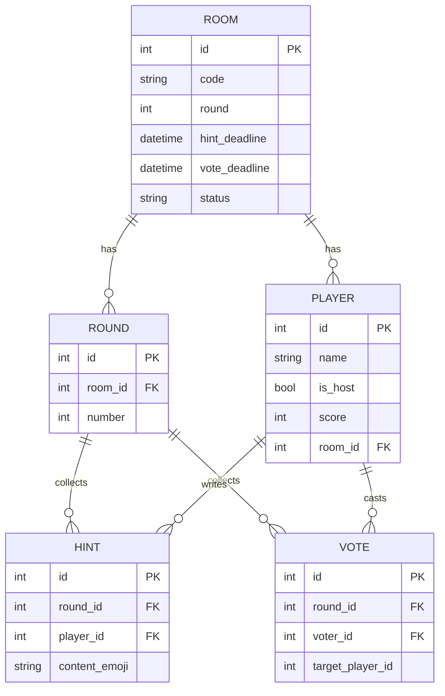

# Emoji Charades (ワードウルフ)

FastAPI + SQLModel/SQLAlchemy + Jinja2 + htmx で作った、ブラウザだけで遊べるオンライン・パーティーゲームです。
ロビー作成 → 参加 → お題（ヒント）投稿 → 投票 → 結果 → 次ラウンド…の流れを最小操作で回します。

---

## Demo


[▶ MP4で見る](./static/demo.mp4)


## Features
- **リアルタイム進行**：2秒ポーリングと HX-Redirect で全員の画面を同期
- **ホスト権限**：start / lock_hints / close_vote / next_round（ホストのみ操作可）
- **スコア集計**：正解投票で +1、（設定により）多数決外れ時のウルフボーナスも対応
- **不正防止**：自分への投票は禁止
- **セッション管理**：Cookie セッションでプレイヤーを追跡
- **拡張性**：Room / Player / Round / Hint / Vote のシンプルなモデル設計

---

## How to Play（遊び方）
1. ロビーを作成してルームコードを共有
2. 参加者は名前を入力して同じルームに参加
3. それぞれが **絵文字（ヒント）** を投稿 → ホストが締切（lock）
4. 表示されたヒントを見て **ウルフが誰か** 投票
5. 結果表示（スコア加算）→ **「次のゲームへ」** ボタンで連戦

---

## Architecture


---

### ER（概念モデル）


---

## Tech Stack
- **Backend**: FastAPI, SQLModel/SQLAlchemy
- **Frontend**: Jinja2, htmx
- **Session**: Starlette SessionMiddleware
- **Others**: Uvicorn (ASGI), Python 3.12

---

## Quick Start (Local)
> **Windows PowerShell 推奨**。`python 3.12` をインストール済み前提。

```powershell
# ① 仮想環境を作成して有効化
python -m venv .venv
.\.venv\Scripts\Activate.ps1

# 実行ポリシーで止まる場合（セッション限定で許可）
# Set-ExecutionPolicy -Scope Process -ExecutionPolicy Bypass

# ② 依存ライブラリをインストール
python -m pip install --upgrade pip
python -m pip install -r requirements.txt
# requirements.txt が無い場合の最小セット：
# python -m pip install fastapi "uvicorn[standard]" sqlmodel sqlalchemy jinja2 python-multipart

# ③ 起動（app/main.py に app = FastAPI() がある前提）
python -m uvicorn app.main:app --host 127.0.0.1 --port 8000
# → http://127.0.0.1:8000  /  API: http://127.0.0.1:8000/docs
```

---

**Git Bash を使う場合**（有効化コマンドのみ異なる）
```bash
source .venv/Scripts/activate
python -m uvicorn app.main:app --host 127.0.0.1 --port 8000
```

---

**macOS / Linux**（参考）
```bash
python3 -m venv .venv
source .venv/bin/activate
python -m pip install --upgrade pip
python -m pip install -r requirements.txt
python -m uvicorn app.main:app --host 127.0.0.1 --port 8000
```

---

## Configuration
- `.env` を作成して環境変数を設定（**コミットしない**）

```
# .env.example（公開用サンプル）
DATABASE_URL=sqlite:///./dev.db
SECRET_KEY=changeme
```

> 本番運用時は Postgres 等の永続DBを推奨（Render/Neon/Supabase など）。

---

## Project Structure（例）
```
emoji-charades/
├─ app/                # FastAPI エンドポイント / 依存関数
├─ templates/          # Jinja2 テンプレート（lobby, hint, vote, result ...）
├─ static/             # CSS/JS/画像/動画（demo.mp4 など）
├─ requirements.txt
├─ .env.example
├─ .gitignore
└─ README.md
```

---

## Roadmap
- お題辞書（topic）
- 匿名投票モード / 投票演出
- 最終結果ページの演出と履歴
- デプロイ（Render/Fly.io/Cloud Run）& 本番 URL 公開

---

## Notes
- セッション Cookie は `HttpOnly` / `SameSite`（本番は `secure`）を推奨
- 複数インスタンス運用を想定し、**状態はDBで一元管理**
- ヘルスチェック用に `/ping` を用意（デプロイ時の監視に使用）

---

## License
- **No license**（閲覧のみ用途）

---

## Acknowledgements
- FastAPI, SQLModel, htmx, Jinja2

---